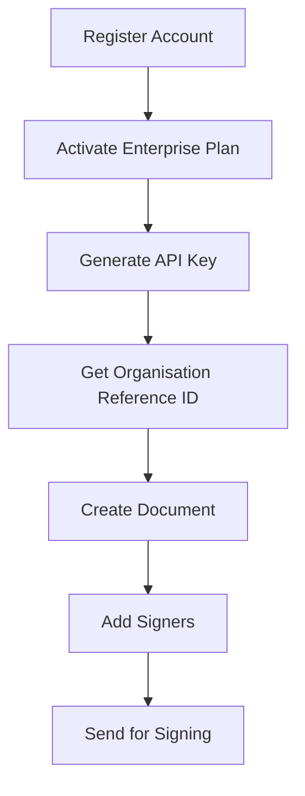

# Developer Settings – Getting Started

## Overview

Your platform provides Document APIs that allow developers to programmatically interact with documents using secure API keys.

To access these APIs, users must:
- Create a developer account
- Subscribe to the Enterprise plan
- Generate API keys
- Use the API keys to authenticate requests

---

## Developer Onboarding Flow

Below is the complete journey a developer follows before using the Document APIs.

### Step 1: Create a Developer Account

Developers must first register using their email address.

**After successful registration:**
- The user gains access to the Developer Dashboard
- The user can navigate to Settings and Billing
- API access is not yet enabled

### Step 2: Subscribe to the Enterprise Plan

Document APIs are available only under the Enterprise Plan.

**To activate API access:**
- Go to Billing
- Select the Enterprise Plan
- Complete the purchase

:::info Plan Status
- If the user has an active Enterprise subscription → API features are enabled
- If not → API key creation will be restricted
:::

### Step 3: Generate API Keys

Once the Enterprise Plan is active:
- Navigate to Settings → API Keys
- Click Create New API Key
- Provide a name for the key
- Copy and securely store the generated key

:::warning
⚠️ API keys are shown only once upon creation.
:::

### Step 4: Use API Keys to Access Document APIs

All Document APIs require authentication using the generated API key.

Authentication is done using:
`Authorization: Bearer YOUR_API_KEY`

**These keys allow:**
- Secure access to Document endpoints
- Scoped usage tied to the user’s Enterprise account
- Usage tracking and billing enforcement

---

## Document API Workflow

Once you have your API key, the document signing flow involves four sequential steps:

### Step A: Get Organisation Reference ID

Retrieve your organisation's `encrypted_reference_id`, which is required to create documents.

- **Endpoint:** `GET /api/v1/developer-settings/profile/organization/`
- The response contains your `encrypted_reference_id`.

### Step B: Create a Document

Upload a PDF document to your organisation.

- **Endpoint:** `POST /api/v1/user-documents/details/`
- Send `title`, `encrypted_reference_id`, `document_file`, and `latest_document_file` as form data.
- Both `document_file` and `latest_document_file` are required — send the same file for both.
- The response returns `reference_id` (DOC_REF_ID) and `organization_document_encrypted_reference_id` (ORG_DOC_REF_ID).

### Step C: Add Signers

Add one or more signers to the document.

- **Endpoint:** `POST /api/v1/user-documents/details/signers/`
- Pass `organisation_doc_reference_id` and `doc_reference_id` as query parameters.
- Send an array of signer objects with `email`, `name`, and optional `signer_type` (`default`, `sweden_bank_id`, `email`, `otp`).
- The response returns `reference_signer_id` for each signer, needed for the next step.

### Step D: Send Document for Signing

Send email notifications to all signers.

- **Endpoint:** `POST /api/v1/user-documents/send-mail/`
- Pass `organisation_doc_reference_id` and `doc_reference_id` as query parameters.
- Include `reference_signer_id` values from Step C in the `data` array.

For detailed API examples with curl commands, see the [Developer API Keys Overview](api-keys-usage).

---

## Access Control Logic

| Condition | Can Create API Keys? | Can Use Document APIs? |
| :--- | :---: | :---: |
| No account | ❌ | ❌ |
| Registered, no Enterprise plan | ❌ | ❌ |
| Enterprise plan active | ✅ | ✅ |

---

## Developer Experience Flow (Simplified)

